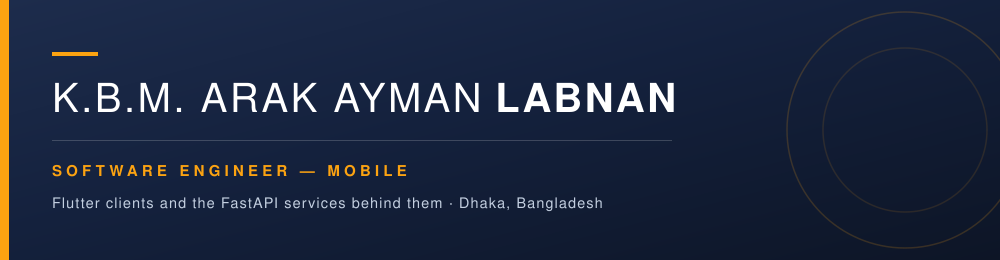
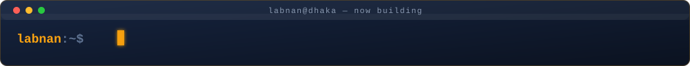
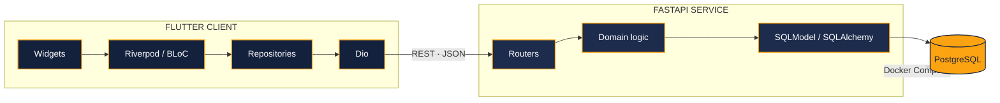
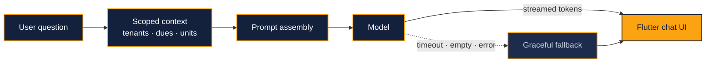

  

  

 

### **I don't hand off the backend.**

Flutter client. FastAPI service. The schema underneath it. 
Concept to store release — no seams, no "that's the other team's problem."

 

  

## Both sides of the API

Most mobile developers stop at the network boundary. I own what's on the other side of it — which is why the discount engine lives on the server where it belongs, and the client stays thin enough to reason about.

Same layering on both sides — because Clean Architecture shouldn't stop at the network call.

## Shipped. Live. On real phones.

| | What it does | What I built |
|---|---|---|
| **[Property Studio](https://play.google.com/store/apps/details?id=com.zuhabul.propertystudio)** 1K+ installs · [site](https://propertystudio.com.bd/) | An operating system for property owners and managers — one app for a single flat or a whole portfolio | Rent and billing automation with late-fee rules, accounting and tax dashboards with unit-level P&L, IoT control for pumps, lighting and lifts — and **Genie**, the in-app AI assistant ([below](#genie--the-llm-feature-that-actually-shipped)) |
| **[Nogora](https://play.google.com/store/apps/details?id=com.nogora.superapp)** Consumer super-app · [site](https://nogora.com/) | City living in Bangladesh, in one secure place | Rent and utility payments with digital receipts and real-time alerts, photo-based maintenance ticketing, encrypted document vault, category-wise budgeting |
| **Ethical Drugs Sales App** Enterprise · ERP-integrated | Field-sales client wired into a group-wide ERP | **Sole developer, both sides.** 13 endpoint modules across auth, customers, products, orders and collections. Multi-tier discount engine (ND/FD/SCD/PB) and invoice allocation modelled server-side. GPS-verified order placement, English and Bengali localisation |

## Genie — the LLM feature that actually shipped

Inside Property Studio there's a chat assistant called **Genie**. A landlord types *"which tenants are overdue this month?"* and gets a straight answer pulled from their own property data — not a generic chatbot reply.

Anyone can wire up a chat completion. The work is everything around it.

**Prompt design** — the assistant answers about *this* user's rent, dues, tenants and units. The real problem is deciding what context to assemble per question, and keeping it scoped, relevant and small.

**Streaming responses** — tokens render as they arrive instead of behind a spinner. In Flutter that means partial state, mid-stream cancellation when the user navigates away, and a chat surface that doesn't jank while rebuilding on every chunk.

**Graceful fallback** — the interesting engineering is the unhappy path. Timeouts, empty completions, malformed output and rate limits all resolve to something useful on screen instead of a stack trace. This is where three years of QA earns its keep: I built the failure modes first.

Live on Google Play. Real users. Real property data.

## What GitHub knows

  

## How I got here

| | Role | Where |
|---|---|---|
| **Dec 2025 — now** | Mobile App Developer | **Sysnova Information Systems** — sister concern of Kazi Farms Group, Dhaka. Production Flutter across Android and iOS for enterprise-scale applications, plus the FastAPI services behind them |
| **Feb — Nov 2025** | Software Engineer, Flutter | **Property Studio**, Dhaka. Core modules of a property platform now past 1K installs — billing automation, accounting dashboards, the IoT control layer |
| **Oct 2021 — Dec 2024** | Senior QA Engineer | **Vcube Soft and Tech**, Dhaka. Test planning across mobile and web release cycles, Selenium regression automation, API validation, defect triage |

Three years breaking other people's software, then two building my own. The order turned out to matter.

## The toolbox

<b>Mobile</b> — Flutter, Dart, and whichever state pattern the problem actually needs

 

GoRouter for navigation, Dio for transport. Riverpod for new work, and I stay fluent in BLoC, GetX and Provider — inherited codebases don't ask your preference.

<b>Backend</b> — Python, FastAPI, PostgreSQL, containerised

 

SQLModel over SQLAlchemy, Pydantic for schema validation, Alembic for migrations. Docker Compose so the whole stack comes up with one command.

<b>Quality</b> — three years of QA, still shaping how I build

 

Three years as a QA engineer, finishing as senior — test planning across mobile and web release cycles, Selenium regression suites, API validation, defect triage.

It's the most useful thing on this page. I design for the edge case while the feature is still on the whiteboard, not after someone files a ticket. Unit and widget tests go in before the release candidate, not after it. A regression-free release is part of shipping the feature — not a phase that follows it.

<b>AI in the loop</b> — daily pair-programming, reviewed like any other diff

 

Scaffolding, boilerplate, test generation. The discipline matters more than the tooling: every suggestion gets reviewed and covered by tests before it merges. Generated code nobody read is just technical debt that arrived faster.

## Credentials you can click

| | Certificate | Issuer | Verify |
|---|---|---|---|
| **2025** | **App Development with Flutter & AI** Two certificates: course completion, and performance | Ostad, Dhaka | [completion ↗](https://ostad.app/share/certificate/c38990-k.b.m.-arak-ayman-labnan) · [performance ↗](https://ostad.app/share/certificate/c40001-k.b.m.-arak-ayman-labnan) |
| **2022** | **Software Testing and Quality Assurance** | Skill Jobs, Dhaka | `SJ/SQA-20220080033` |

Ostad issues two certificates for that course — one for finishing it, one for how it was finished. The AI half of the syllabus is what became **Genie**, the LLM assistant now live inside Property Studio.

**Currently studying** — Clean Architecture and SOLID in Flutter, advanced state-management patterns, Python and FastAPI. **Just started on machine learning** — the fundamentals, from the Python side I already work in.

## Remote, and actually overlapping

Based in **Dhaka, UTC+6** — which lines up with more of the world than people assume.

| Region | Daily overlap on a normal Dhaka workday |
|---|---|
| Gulf (UTC+3/+4) | **~8 hours** |
| Central Europe (UTC+2) | **~6 hours** |
| UK (UTC+1) | **~5 hours** |

**English** — professional working proficiency, written and spoken. **Bangla** — native.

Comfortable async: written standups, decisions recorded in the PR, and enough detail in a handover that nobody has to wait for my morning.

<b>Education and training</b>

 

| | Qualification | Institution | Result |
|---|---|---|---|
| **2017 — 2021** | BSc in Computer Science and Engineering | Daffodil International University | CGPA **3.37 / 4.00** |
| **2014 — 2015** | Higher Secondary School Certificate | Cantonment Public School & College, Saidpur | GPA **5.00 / 5.00** |
| **2012 — 2013** | Secondary School Certificate | Thakurgaon Govt. Boys' High School | GPA **5.00 / 5.00** |

Placed **4th in C programming** at the DIU Take-off Programming Contest, Summer 2017 — first semester, first contest.

Certificates live in [Credentials you can click](#credentials-you-can-click) above.

**Currently** deepening Clean Architecture in Flutter and building out the FastAPI side of the stack. 
**Open to** remote work with international teams.

 

