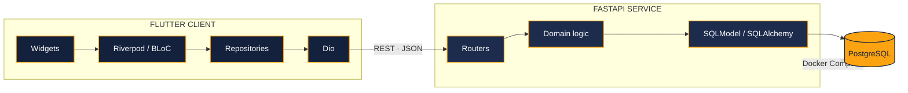
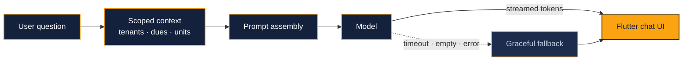

  

**I don't hand off the backend.** I build the Flutter client, the FastAPI service behind it, and the schema underneath that — concept to store release.

---

## How I build

Most mobile developers stop at the API boundary. I own both sides of it — which means the discount engine lives on the server where it belongs, and the client stays thin.

Both sides layered the same way, because Clean Architecture shouldn't stop at the network call.

---

## Shipped and live

| | What it does | My part |
|---|---|---|
| **[Property Studio](https://play.google.com/store/apps/details?id=com.zuhabul.propertystudio)** 1K+ installs · [site](https://propertystudio.com.bd/) | Operating system for property owners and managers — one app for a single flat or a whole portfolio | Rent and billing automation with late-fee rules, accounting and tax dashboards with unit-level P&L, IoT control for pumps, lighting and lifts — and **Genie**, the in-app AI assistant ([below](#genie--an-llm-feature-that-actually-shipped)) |
| **[Nogora](https://play.google.com/store/apps/details?id=com.nogora.superapp)** Consumer super-app · [site](https://nogora.com/) | City living in Bangladesh, in one secure place | Rent and utility payments with digital receipts and real-time alerts, photo-based maintenance ticketing, encrypted document vault, category-wise budgeting |
| **Ethical Drugs Sales App** Enterprise · ERP-integrated | Field-sales client wired into a group-wide ERP | **Sole developer, both sides.** 13 endpoint modules across auth, customers, products, orders and collections. Multi-tier discount engine (ND/FD/SCD/PB) and invoice allocation modelled server-side. GPS-verified order placement, English and Bengali localisation |

---

## Genie — an LLM feature that actually shipped

Inside Property Studio there's a chat assistant called **Genie**. A landlord types *"which tenants are overdue this month?"* and gets a straight answer drawn from their own property data — not a generic chatbot reply.

Plenty of people have wired up a chat completion. The work is everything around it.

**Prompt design** — the assistant answers about *this* user's rent, dues, tenants and units, so the real problem is deciding what context to assemble per question and keeping it scoped, relevant and small.

**Streaming responses** — tokens render as they arrive rather than after a spinner. In Flutter that means handling partial state, mid-stream cancellation when the user navigates away, and a chat surface that doesn't jank while rebuilding on every chunk.

**Graceful fallback** — the interesting engineering is the unhappy path. Timeouts, empty completions, malformed output and rate limits all resolve to something useful on screen instead of a stack trace. This is where three years of QA earns its keep: I built the failure modes first.

Live on Google Play, in front of real users, on real property data.

---

## Career

| | Role | Where |
|---|---|---|
| **Dec 2025 — now** | Mobile App Developer | **Sysnova Information Systems** — sister concern of Kazi Farms Group, Dhaka. Production Flutter across Android and iOS for enterprise-scale applications, plus the FastAPI services behind them |
| **Feb — Nov 2025** | Software Engineer, Flutter | **Property Studio**, Dhaka. Core modules of a property platform now past 1K installs — billing automation, accounting dashboards, the IoT control layer |
| **Oct 2021 — Dec 2024** | Senior QA Engineer | **Vcube Soft and Tech**, Dhaka. Test planning across mobile and web release cycles, Selenium regression automation, API validation, defect triage |

Three years testing other people's software, then two building my own. The order turned out to matter.

---

## Stack

<b>Mobile</b> — Flutter, Dart, and whichever state pattern the problem actually needs

 

GoRouter for navigation, Dio for transport. I pick Riverpod for new work and stay fluent in BLoC, GetX and Provider because inherited codebases don't ask your preference.

<b>Backend</b> — Python, FastAPI, PostgreSQL, containerised

 

SQLModel over SQLAlchemy, Pydantic for schema validation, Alembic for migrations. Docker Compose so the whole stack comes up with one command.

<b>Quality</b> — three years of QA, still shaping how I build

 

I spent three years as a QA engineer, finishing as senior — test planning across mobile and web release cycles, Selenium regression suites, API validation, defect triage.

It's the most useful thing on this page. I design for the edge case while the feature is still on the whiteboard, not after someone files a ticket. Unit and widget tests go in before the release candidate, not after it. A regression-free release is part of shipping the feature — not a phase that follows it.

---

## Working with AI

Daily AI pair-programming for scaffolding, boilerplate and test generation. The discipline matters more than the tooling: every suggestion gets reviewed and covered by tests before it merges. Generated code that nobody read is just technical debt that arrived faster.

---

## Working remotely

Based in **Dhaka, UTC+6** — which lines up better with more of the world than people assume.

| Region | Daily overlap on a normal Dhaka workday |
|---|---|
| Gulf (UTC+3/+4) | **~8 hours** |
| Central Europe (UTC+2) | **~6 hours** |
| UK (UTC+1) | **~5 hours** |

**English** — professional working proficiency, written and spoken. **Bangla** — native.

Comfortable working async: written standups, decisions recorded in the PR, and enough detail in a handover that nobody has to wait for my morning.

<b>Education and training</b>

 

**BSc in Computer Science and Engineering** — Daffodil International University, 2017–2021. CGPA 3.37 / 4.00. Placed 4th in C programming at the DIU Take-off Programming Contest.

**Software Testing and Quality Assurance** — Skill Jobs, Dhaka, 2022. Certificate SJ/SQA-20220080033.

**Ongoing** — Clean Architecture and SOLID in Flutter, advanced state-management patterns, Python and FastAPI.

---

Currently deepening Clean Architecture in Flutter and building out the FastAPI side of my stack. Interested in remote work with international teams.

